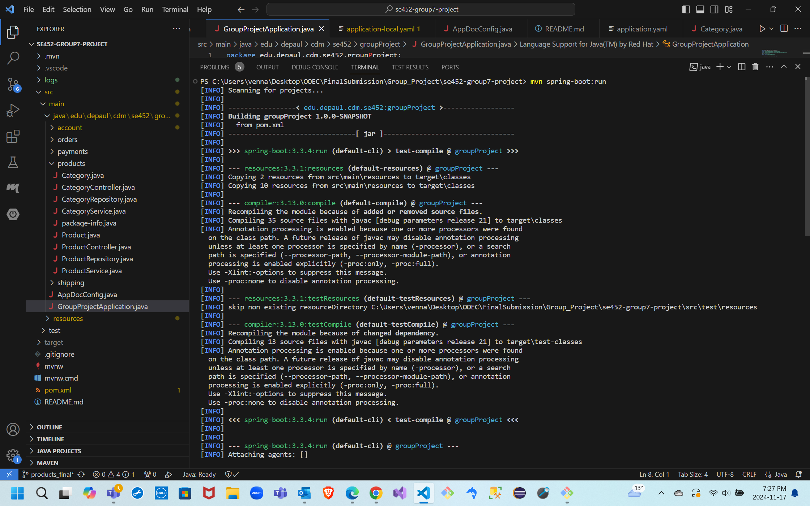

# se452-group7-project

This repository serves as the group project for SE452 - Group 7 - Fall 2024   

**Project Scope Area**
---
_E-commerce Application_: 
We are building a simple shopping application where users can create accounts, browse different products and categories, place orders, make payments, and manage shipping for their purchases. The app will allow users to track shipping status, providing a seamless shopping experience from product selection to delivery.

**Project Members**
---
| Name              | Functional Area |
|------------------ | --------------- |
| Bhumika Ramesh    | Account Management |
| Sai Rachana Venna | Products and Categories |
| Mohammed Saalim Kartapillai | Orders and Cart Module |
| Likith Reddy Vangumalla | Payments and Transaction Management|
| Pritiv Janarthanan      | Shipping |

**Initial key features for each of the members of the team**
---
_Bhumika Ramesh_

For the account management feature, I will focus on implementing user registration and authentication, allowing users to create accounts securely. This will include functionality for password recovery and reset, ensuring that users can easily regain access if needed. Additionally, I will develop profile management capabilities allowing users to update their personal information.

_Sai Rachana Venna_

In this module, I will be working on features that would allow the users to browse, search and view the products based on their availability. 
Each product will be linked to one or more categories that would allow the users to filter the products based on the specific category selection. 
Product availability will also be tracked and only the available products would be displayed to the users. 
All the CRUD operations and the services related to products and their categories will also be handled in this module. 
Unit tests relevant to this module will also be created. 

_Saalim_

I will focus on developing the Orders and Cart module. This module will allow users to add products to their cart, view their cart, and modify the items or quantities in their cart. Additionally, I will implement functionality for placing orders, tracking the order status, and storing order details in the database. The module will also include calculating totals, managing cart items in session, and ensuring smooth transition from cart to order placement. I will also ensure that users can view their past orders and receive order confirmations.

_Likith Reddy Vangumalla_

I will handle the Payments module, focusing on integrating secure payment methods such as credit cards and digital wallets. This module will process transactions, manage payment validation, and ensure encrypted data handling. I will also implement features for transaction failure management, payment confirmations, and storing transaction history. Additionally, the module will smoothly integrate with the cart and order modules to provide a seamless user experience. Unit tests will ensure the reliability and security of the payment system.

_Pritiv Janarthanan_  

For the Shipping module, I will focus on handling shipping details for orders. This includes creating shipping records, associating them with specific orders, and tracking their shipping status. The module will also allow for the modification of shipping details and status updates. Additionally, I will add unit tests to verify the accuracy and functionality of the Shipping module.

**Github location**
---
https://github.com/mohammed-saalim/se452-group7-project

**Conflict Resolution**
---
Brain storm together and decide based on what majority of the team members agree on.

**Communication Mechanism**
---
Primary - Microsoft Teams chat for day-to-day communication.
Secondary - Email for official communication and GitHub for issue tracking.
Meetings - Weekly virtual meetings via Teams to review progress and assign new tasks.

**Decision Made**
---
| # |     Area                 | Decision        | Rationale                                         |
|---| -----------------------  | --------------- | ------------------------------------------------- |
| 1 |  IDE                     |  VS Code        | Everyone in the team is familiar with this editor |
| 2 |  Dependency Management   |  Maven          | Easy to build a project to the jar, war or any other format |
| 3 |  Code                    |  Lombok         | Team wants to learn and implement Lombok usage    |
| 4 |  Configuration Management|  Yaml           | Easier to view groups of configuration            |
| 5 |  Database                |  H2             | In memory database promoting ease in usage        |

**Meeting Journal**
---
We all had a connect and firstly we discussed about the feedback received for Milestone 2.
We then tried to fix the issues mentioned in the git hub repository for Milestone 2.
After fixing them, we then discussed about what dependencies and features we would add to each of our functionalities that we have selected to display non persistence for Milestone 3.
We then proceeded to work on the non persistence code related to each of our functionalities that we have taken individually.
After pushing the code changes to the git repository, we then connected again to review the updated code and do the pull request approvals and code merges.
 

**Screenshots of working code (clean compile)**
---

